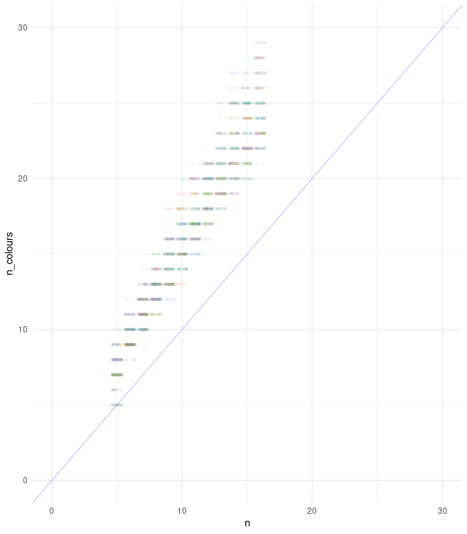

Colouring Queen Graphs
================
Matthew Henderson
22/09/2021

-   [Using ccli from R](#using-ccli-from-r)
-   [Number of colours used in a greedy
    colouring](#number-of-colours-used-in-a-greedy-colouring)
-   [Colouring Queen Graphs](#colouring-queen-graphs)
-   [Colouring Queen Graphs II](#colouring-queen-graphs-ii)

## Using ccli from R

ccli is a bash script for calling Culberson’s colouring programs from
the command-line.

The `ccli_greedy` function below is used to call Culberson’s greedy
program from R via ccli.

There is no return value from `ccli_greedy`. Instead the result if
written to a file which has the same name as the input file appended
with a .res extension.

Notice here that both ccli and culberson’s colouring programs have been
installed under /opt and so those paths have to be given in the env
argument.

``` r
ccli_greedy <- function(problem_file, seed = 42, type = "random", ordering = "lbfsd") {
  system2("ccli",
    args = glue::glue("greedy --type={type} --ordering={ordering} --seed={seed} {problem_file}"),
    env = "PATH=$PATH:/opt/color/bin:/opt/ccli/",
    stdout = FALSE, stderr = FALSE)
}
```

For example, to colour the 16x16 queen graph using random vertex
ordering and a simple greedy approach.

``` r
set.seed(42)

ccli_greedy(problem_file = "graphs/queen16_16.col",
            type = "simple", ordering = "random")
```

``` r
readLines(file("graphs/queen16_16.col.res"))
#>  [1] "CLRS 23 FROM GREEDY cpu =  0.00 pid = 26540"                                     
#>  [2] " 20   5   7  22  10  12   4   9   6  11  14   2   8   3   1  15   1  15  11   6 "
#>  [3] " 18  14  19   2  17   5   4   3  16  13   7  10   2   3   8   9  17  10  11   1 "
#>  [4] " 13  18  21   7  15  20   4   6  12   4  10  13  15  20   5  18   8   1  11  19 "
#>  [5] " 17   6   3   7   5  17  12  11   3   4   1  15  16   6  10  14   7   8  18   9 "
#>  [6] " 11   2   1  10   8  16   7   4  12   9   3  20  13  15  19  17   7  14  13   2 "
#>  [7] "  6  22  12   8  23  21   1   9   3  10  11   5  18  16   9  21  13   7  17  14 "
#>  [8] "  2   3  20  22   5  19  12   4   4   7   3  16  11   9  18  19  22  10   5   1 "
#>  [9] "  2  21  15   8  10  11   6  20   1   3  16  21  15  19  12   8   9   5  17  14 "
#> [10] " 19   1  15  14  12  13   8   5  11   4   9  16  10   7   6   2   9  18   2   7 "
#> [11] "  5  15  21   6  14  16  13  11  20  12   8   3   6  20  16  12   9   1  13   3 "
#> [12] "  7  15   8  18   4  14   2  11  15   8  18  17   7   2  20  10   4  14  19   5 "
#> [13] " 12   1  13  16  17  10   5  19   4   8   3  11   9  12  15   6  14   2  21   1 "
#> [14] "  8  13  14   1  16   6  22  12   3   2   7   4  21   9   5  18 "
```

## Number of colours used in a greedy colouring

In the next section we present the results of an experiment into greedy
colouring of queen graphs. For this experiment we need a function that
calls `ccli_greedy` and parses the number of colours used from the
resulting output file.

``` r
ccli_greedy_clrs <- function(problem_file, seed = 42, type = "simple", ordering = "random") {
  output_file <- paste0(problem_file, ".res")
  if(file.exists(output_file)) {
    file.remove(output_file)
  }
  x <- ccli_greedy(problem_file, seed, type, ordering)
  output <- readr::read_file(output_file)
  file.remove(output_file)
  as.numeric(stringr::str_match_all(output, "CLRS ([0-9]+)")[[1]][,2])
}
```

For example,

``` r
ccli_greedy_clrs(problem_file = "graphs/queen16_16.col",
                 type = "simple", ordering = "random")
#> [1] 23
```

Notice that this number can be much larger than the number of colours in
a colouring with the minimal number of colours.

# Colouring Queen Graphs

This experiment will test different combinations of algorithms, vertex
orderings and random seeds on the number of colours used in colourings
of queen graphs.

The entire experiment will be represented by a tibble with variables for
each of the tested parameters. A row of the tibble represents a single
colouring and after the experiment is finshed we will augment this
tibble with a new column giving the number of colours used in each
colouring.

Here is an example with three colourings of the 10x10 queen graph and
three colourings of the 16x16 queen graph. All use a simple greedy
approach with random vertex ordering. The only difference in each call a
different seed is used.

``` r
library(tibble)

(experiments <- tribble(~problem_file, ~seed, ~type, ~ordering,
        "graphs/queen10_10.col", 42, "simple", "random",
        "graphs/queen10_10.col", 43, "simple", "random",
        "graphs/queen10_10.col", 44, "simple", "random",
        "graphs/queen16_16.col", 42, "simple", "random",
        "graphs/queen16_16.col", 41, "simple", "random",
        "graphs/queen16_16.col", 40, "simple", "random",
        ))
#> # A tibble: 6 x 4
#>   problem_file           seed type   ordering
#>   <chr>                 <dbl> <chr>  <chr>   
#> 1 graphs/queen10_10.col    42 simple random  
#> 2 graphs/queen10_10.col    43 simple random  
#> 3 graphs/queen10_10.col    44 simple random  
#> 4 graphs/queen16_16.col    42 simple random  
#> 5 graphs/queen16_16.col    41 simple random  
#> 6 graphs/queen16_16.col    40 simple random
```

Use mutate from dplyr and pmap from purrr to run an experiment for each
row and augment the data frame with the number of colours used.

``` r
library(dplyr)
library(purrr)

(results <- experiments %>%
  mutate(
    n_colours = pmap_dbl(experiments, ccli_greedy_clrs)
  ))
#> # A tibble: 6 x 5
#>   problem_file           seed type   ordering n_colours
#>   <chr>                 <dbl> <chr>  <chr>        <dbl>
#> 1 graphs/queen10_10.col    42 simple random          16
#> 2 graphs/queen10_10.col    43 simple random          17
#> 3 graphs/queen10_10.col    44 simple random          15
#> 4 graphs/queen16_16.col    42 simple random          23
#> 5 graphs/queen16_16.col    41 simple random          23
#> 6 graphs/queen16_16.col    40 simple random          23
```

Now summarise the experiments to find the minimum number of colours used
in colourings of each graph.

``` r
results %>%
  group_by(problem_file) %>%
  summarise(
    n_colours = min(n_colours)
  )
#> # A tibble: 2 x 2
#>   problem_file          n_colours
#>   <chr>                     <dbl>
#> 1 graphs/queen10_10.col        15
#> 2 graphs/queen16_16.col        23
```

Notice that in this experiment we are trusting that the files represent
the graphs they claim to represent. But we don’t really know that. So
here is a good application for the work on graph property testing.

# Colouring Queen Graphs II

Now lettuce really do a bigger experiment.

``` r
library(glue)

n_iter <- 50
orders <- 5:16

set.seed(42)

seeds <- sample(1:100000, n_iter)
files <- glue("queen{orders}_{orders}.col") %>% as.character()

(experiments <- list(
  problem_file = file.path("graphs", files),
  type = c("simple", "random"),
  ordering = c("random", "lbsfr"),
  seed = seeds
) %>%
  cross_df())
#> # A tibble: 2,400 x 4
#>    problem_file          type   ordering  seed
#>    <chr>                 <chr>  <chr>    <int>
#>  1 graphs/queen5_5.col   simple random   61413
#>  2 graphs/queen6_6.col   simple random   61413
#>  3 graphs/queen7_7.col   simple random   61413
#>  4 graphs/queen8_8.col   simple random   61413
#>  5 graphs/queen9_9.col   simple random   61413
#>  6 graphs/queen10_10.col simple random   61413
#>  7 graphs/queen11_11.col simple random   61413
#>  8 graphs/queen12_12.col simple random   61413
#>  9 graphs/queen13_13.col simple random   61413
#> 10 graphs/queen14_14.col simple random   61413
#> # … with 2,390 more rows
```

``` r
library(tictoc)

tic()
(results <- experiments %>%
  mutate(
    n_colours = pmap_dbl(experiments, ccli_greedy_clrs)
  ))
#> # A tibble: 2,400 x 5
#>    problem_file          type   ordering  seed n_colours
#>    <chr>                 <chr>  <chr>    <int>     <dbl>
#>  1 graphs/queen5_5.col   simple random   61413         9
#>  2 graphs/queen6_6.col   simple random   61413        10
#>  3 graphs/queen7_7.col   simple random   61413        11
#>  4 graphs/queen8_8.col   simple random   61413        12
#>  5 graphs/queen9_9.col   simple random   61413        13
#>  6 graphs/queen10_10.col simple random   61413        15
#>  7 graphs/queen11_11.col simple random   61413        16
#>  8 graphs/queen12_12.col simple random   61413        18
#>  9 graphs/queen13_13.col simple random   61413        21
#> 10 graphs/queen14_14.col simple random   61413        21
#> # … with 2,390 more rows
toc()
#> 121.824 sec elapsed
```

``` r
(min_colours <- results %>%
  group_by(problem_file) %>%
  summarise(
    n_colours = min(n_colours)
  ))
#> # A tibble: 12 x 2
#>    problem_file          n_colours
#>    <chr>                     <dbl>
#>  1 graphs/queen10_10.col        14
#>  2 graphs/queen11_11.col        15
#>  3 graphs/queen12_12.col        16
#>  4 graphs/queen13_13.col        18
#>  5 graphs/queen14_14.col        19
#>  6 graphs/queen15_15.col        21
#>  7 graphs/queen16_16.col        22
#>  8 graphs/queen5_5.col           5
#>  9 graphs/queen6_6.col           8
#> 10 graphs/queen7_7.col          10
#> 11 graphs/queen8_8.col          11
#> 12 graphs/queen9_9.col          12
```

``` r
library(ggplot2)
library(stringr)

results %>%
  mutate(
    n = as.numeric(str_match(problem_file, "([0-9]+).col")[,2])
  ) %>%
  ggplot(aes(n, n_colours)) +
    geom_point(size = .5, alpha = .5) +
    geom_abline(colour = "blue", alpha = .2, slope = 1, intercept = 0) +
    ylim(0, 30) +
    xlim(0, 30) +
    theme_light()
```

<!-- -->
