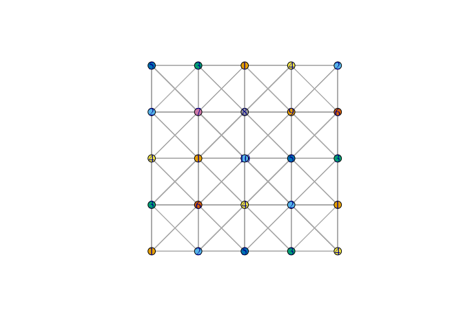

Colouring Queen Graphs
================
Matthew Henderson
14/09/2022

-   [Colouring Queen Graphs in R with
    ccli](#colouring-queen-graphs-in-r-with-ccli)
-   [Grundy Number of a Queen Graph](#grundy-number-of-a-queen-graph)

# Colouring Queen Graphs in R with ccli

``` r
library(dplyr)
library(ggplot2)
library(here)
library(igraph)
library(readr)
library(stringr)

source(here("R", "ccli_greedy.R"))

queen_path <- here("graphs", "queen5_5.col")

queen5 <- read_graph(queen_path, format = "dimacs")

coloured_queen <- set_vertex_attr(queen5, "color", value = ccli_greedy_colouring(queen_path))

plot(queen5,
     vertex.size = 8,
     vertex.size2 = 8,
     vertex.label = NA,
     vertex.color = vertex_attr(coloured_queen, "color"),
     edge.arrow.mode = 0,
     layout = layout_on_grid)
```

<!-- -->

# Grundy Number of a Queen Graph

Could the Grundy number of a n x n Queen graph be 2n? Some tenuous
evidence in this plot.

For Grundy numbers we want something that works like Kempe reductions
but does the opposite. To increase the number of colours used.

<!-- -->
